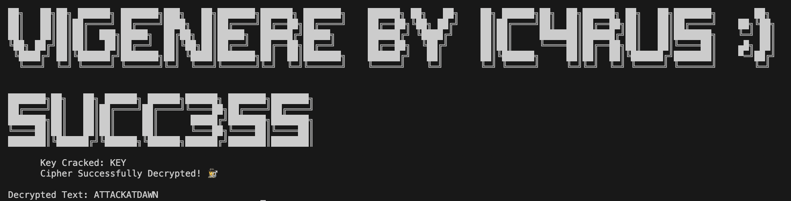

# Vig3n3r3 - Vigenère Cipher Cracker

## Overview

Vig3n3r3 is a Python tool for encrypting and cracking messages encrypted using the Vigenère cipher. It supports multiple cryptanalysis methods, such as brute force, dictionary attacks, and crib attacks, making it versatile for different scenarios.

## Features

- **Encryption/Decryption**: Use the Vigenère cipher to encode and decode messages.
- **Cryptanalysis Methods**:
  - **Brute-force**: Automatically try all possible keys up to a specified length.
  - **Dictionary attack**: Use a predefined wordlist to find the correct key.
  - **Crib attack**: Use known plaintext (crib) to assist in key discovery.

## Screenshot

Here is a screenshot of part of the code used in Vig3n3r3:

## Medium Article

For more details on the development of this project and the fascinating history behind the Vigenère cipher, check out my article on Medium:

[**The Vigenère Cipher: From Unbreakable Enigma to Cryptographic Relic**](https://medium.com/@jamesjinghuang/the-vigen%C3%A8re-cipher-from-unbreakable-enigma-to-cryptographic-relic-215761d30af8)